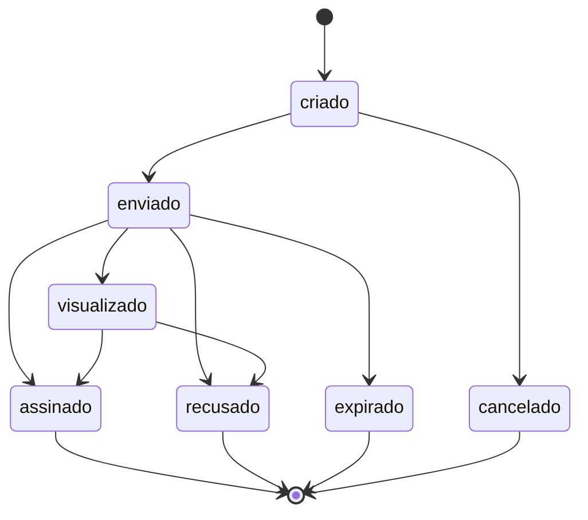

# bitrix24-esign-tracker

Recebe os eventos do provedor de assinatura eletrônica e move o negócio no
Bitrix24 — com HMAC verificado e uma máquina de estados que recusa evento
fora de ordem.


---

## O problema

Um webhook de assinatura é um **endpoint público que fecha contratos no seu
CRM**. Duas coisas precisam ser verdade antes de ele mexer em qualquer coisa.

### 1. A origem é autêntica

Sem verificação HMAC, quem descobrir a URL fecha negócios no seu funil. E a
verificação tem duas armadilhas:

**Comparar com `==` vaza o segredo.** A comparação de strings do Python
curto-circuita no primeiro byte diferente. Medindo o tempo de resposta, dá
para descobrir a assinatura byte a byte. Este projeto usa
`hmac.compare_digest`, que roda em tempo constante.

**Reserializar o JSON quebra a assinatura.** O HMAC é sobre os **bytes exatos
recebidos**. O provedor manda `{"event":"signed"}` e o `json.dumps` do Python
devolve `{"event": "signed"}` — com espaço. Validar sobre o reserializado
funciona no teste e falha em produção. Tem teste documentando exatamente isso.

### 2. A transição faz sentido

Provedores reenviam eventos e **a ordem de chegada não é garantida**. Uma
retentativa pode entregar `assinado` depois de `recusado`. Sem máquina de
estados, o último a chegar ganha — e um contrato recusado aparece como
fechado no relatório do mês.



Estados terminais não aceitam nada depois. Pular `visualizado` é permitido —
o cliente pode assinar sem que o evento de abertura chegue antes.

---

## Um dialeto por provedor

Clicksign manda `document.signed`. D4Sign manda `tipo_post: "4"`. Outro manda
`completed`. A tradução fica num mapa só, então o resto do robô ignora qual
serviço está em uso — trocar de fornecedor mexe em um arquivo.

---

## Uso

```bash
pip install -e ".[dev]"
cp .env.example .env   # BITRIX_WEBHOOK e ESIGN_WEBHOOK_SECRET

python -m esign                          # desenvolvimento
uvicorn esign.__main__:app --host 0.0.0.0 # produção, atrás de proxy com TLS
```

Aponte o webhook do provedor para `POST /webhook/assinatura`.

Campos personalizados esperados no negócio:

| Campo | Para quê |
|---|---|
| `UF_CRM_DOC_ASSINATURA` | chave do documento no provedor |
| `UF_CRM_STATUS_ASSINATURA` | estado atual, alimenta a máquina |

---

## Decisões técnicas

**202 rápido e sempre — exceto no HMAC inválido.** Provedor trata resposta
lenta ou 5xx como falha e reenvia, às vezes em escalada. Um erro no CRM
virando tempestade de retentativas piora o problema em vez de resolver. O
único caso que devolve erro é assinatura inválida: essa não deve ser
reenviada, deve ser investigada.

**Sem segredo configurado, o serviço não sobe.** `segredo_do_ambiente()`
levanta na importação. Falhar na subida é melhor que expor um endpoint que
aceita qualquer requisição.

**`criar_app` recebe suas dependências.** O teste monta um app com um
rastreador de mentira sem tocar em variável global nem em portal real.

**FastAPI importado no topo do módulo, não dentro da função.** Sutil e caro:
com `from __future__ import annotations` as anotações viram strings, e o
FastAPI as resolve contra os **globais do módulo**. Com o import dentro de
`criar_app`, `Request` e `Response` não existem ali — e o FastAPI, sem
conseguir resolvê-los, os trata como parâmetros de query. Todo `POST` volta
`422 field required: request`, sem nenhuma pista da causa real. Esse bug
apareceu na primeira execução dos testes.

---

## Testes

```bash
pytest -q
```

35 testes. Os de segurança cobrem corpo adulterado com assinatura válida de
outro payload, segredo ausente (que não pode virar "aceita tudo") e a
reserialização. Os de resiliência garantem que evento desconhecido e erro no
CRM ainda respondem 202 — e que nada disso chega ao CRM sem HMAC válido.

## Licença

MIT.
